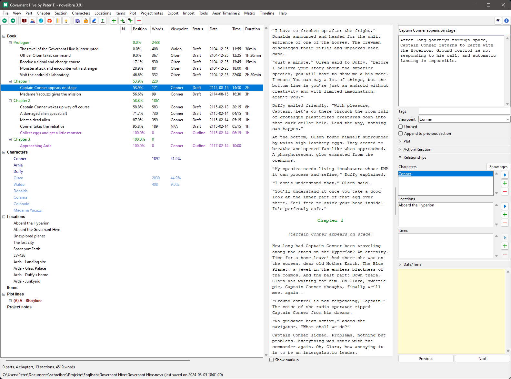
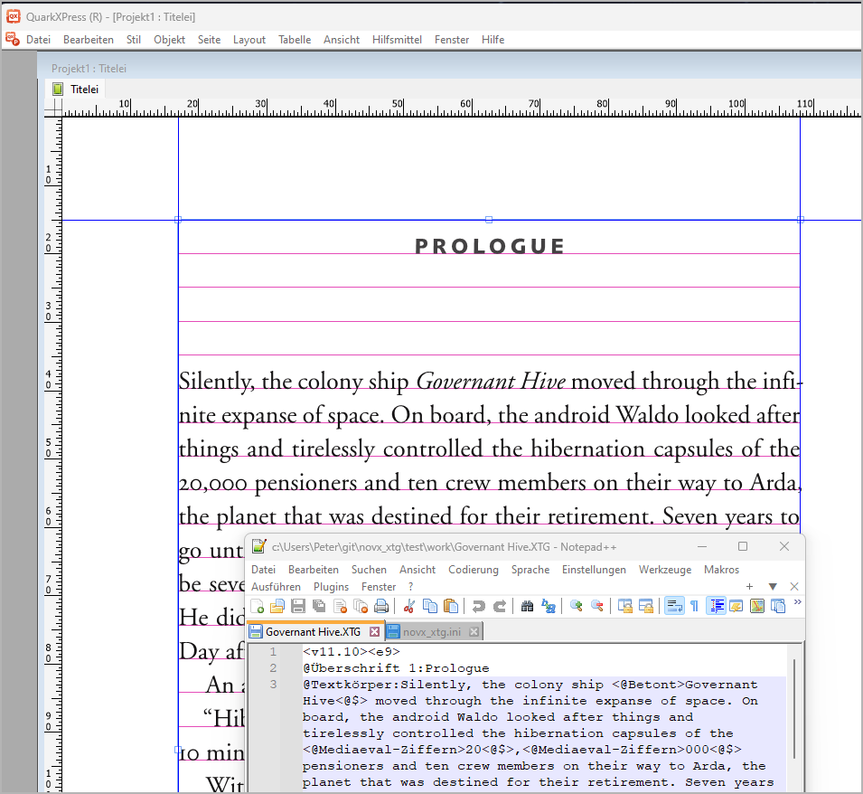

[Home page](index.html)

---

# Applications

---

## novelibre

An application for novelists who prefer to write with LibreOffice or OpenOffice, but need additional features for the organization of their work.

---

## scap_novx

Generate a *novelibre* project from a Scapple outline.

---

## novx_xtg

XPress tagged text export from *novelibre* projects.

