# My open source projects on GitHub

---

## -- OpenOffice/LibreOffice helpers for self publishers

---

### The "curly" extensions for OpenOffice and LibreOffice
"Curly quotes" conversion.

[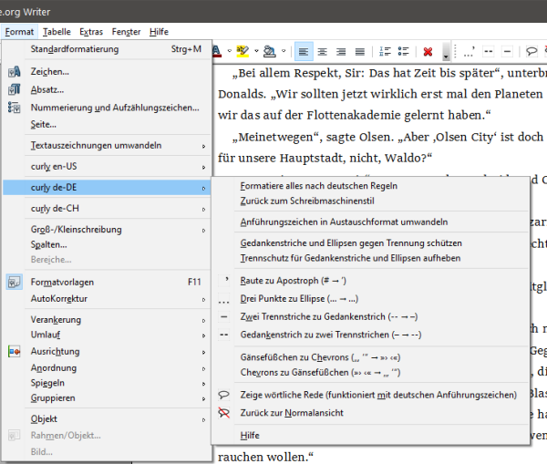](https://peter88213.github.io/curly/)

<!---

### The curly-fr-fr extension

### The curly-en-us extension

### The curly-en-gb extension

### The curly-de-de extension

### The curly-de-ch extension

--->

---

### The StyleSwitcher extension for OpenOffice and LibreOffice
A style switcher extension.

[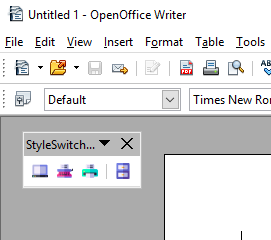](https://peter88213.github.io/StyleSwitcher/)

---

### The emph extension for OpenOffice
Use character styles instead of direct formatting to mark up text.

[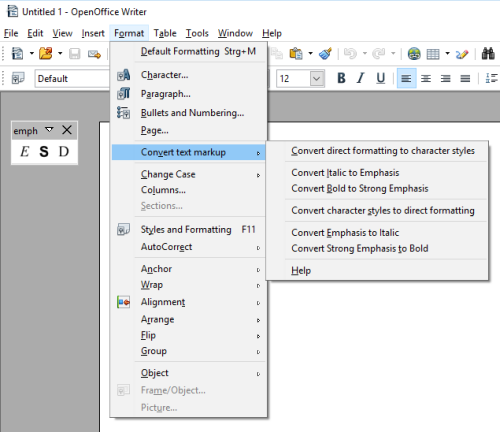](https://peter88213.github.io/emph/)

---

### The poemenia extension for OpenOffice

Localize the Pepito Cleaner extension.

[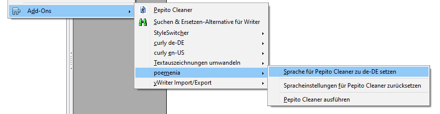](https://peter88213.github.io/poemenia/)

---

## Applications

---

### noveltree

A novel organizer for writers.

[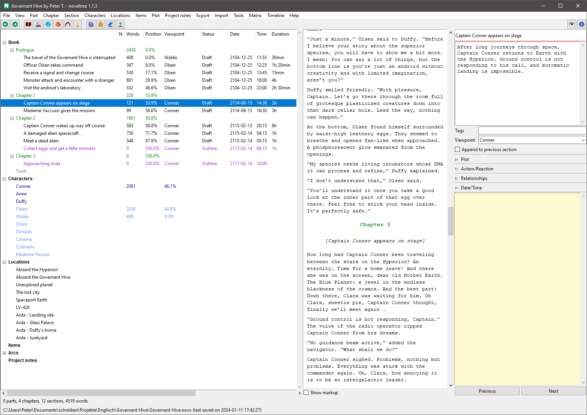](https://peter88213.github.io/noveltree/)

---

### scap_novx

Generate a *noveltree* project from a Scapple outline.

[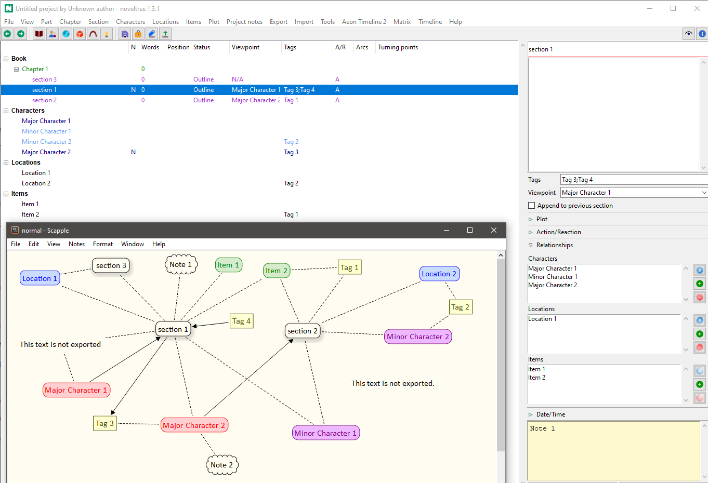](https://peter88213.github.io/scap_novx/)

---

### novx_xtg

XPress tagged text export from *noveltree* projects.

[novx_xtg](https://peter88213.github.io/novx_xtg/)

---

## -- The yWriter toolbox

---

### The yw-cnv extension for LibreOffice

Import and export yWriter 7 projects.

[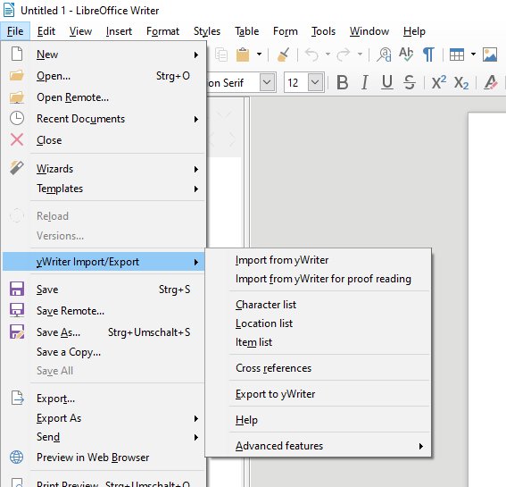](https://peter88213.github.io/yw-cnv/)

---

### The pywoo extension for OpenOffice and Python

Import and export yWriter 7 projects.

[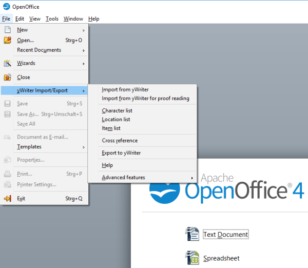](https://peter88213.github.io/pywoo/)

---

### ProofYw7

Import and export ywriter7 scenes for proof reading.

[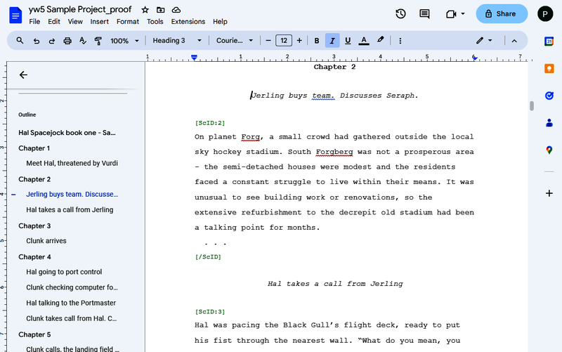](https://peter88213.github.io/ProofYw7/)

---

### yw-viewer

Quickly view yWriter projects.

[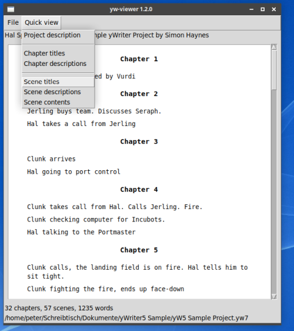](https://peter88213.github.io/yw-viewer/)

---

### yw-timeline

Synchronize yWriter with Timeline.

[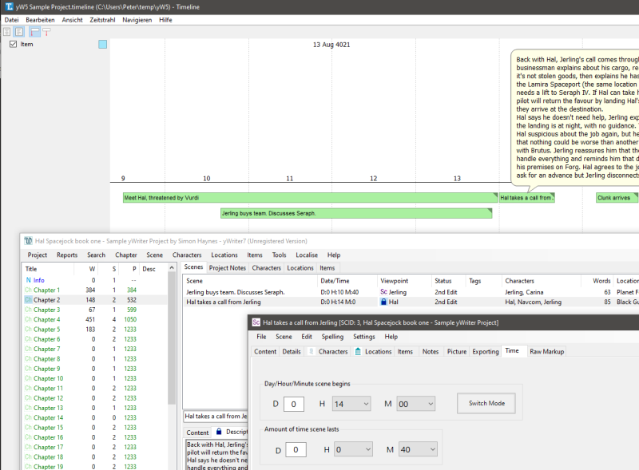](https://peter88213.github.io/yw-timeline/)

---

### yw-table

A relationship table for yw7 files.

[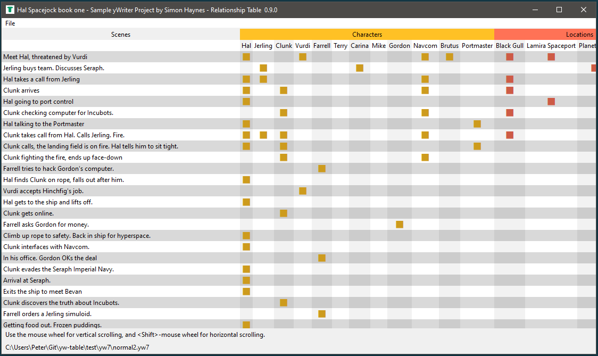](https://peter88213.github.io/yw-table/)

---

### yw-reporter

Configurable report generator for yWriter projects.

[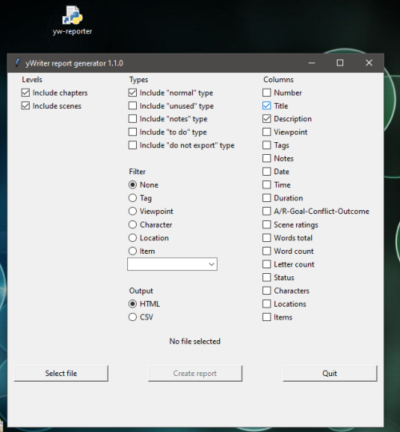](https://peter88213.github.io/yw-reporter/)

---

### yw2oxml

yWriter to Open XML standalone converter.

[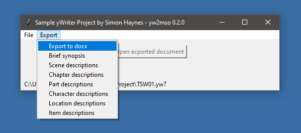](https://peter88213.github.io/yw2oxml/)

---

### mm2yw7

Generate a yWriter 7 project from a FreeMind outline. 

[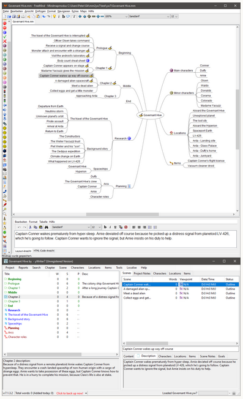](https://peter88213.github.io/mm2yw7/)

---

### yw-renumber 

Renumber yWriter chapters.

[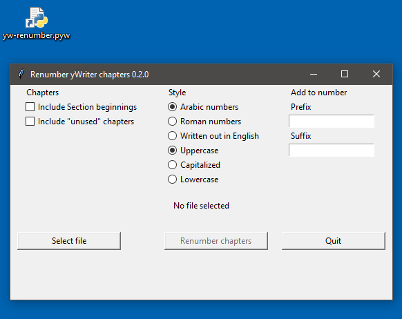](https://peter88213.github.io/yw-renumber/)

---

### yw2oo

yWriter to OpenOffice/LibreOffice standalone converter.

[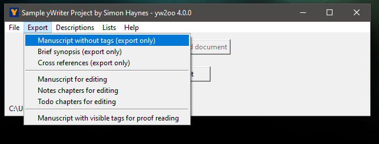](https://peter88213.github.io/yW2OO/)

---

### yw2html

HTML export from yWriter with custom templates.

[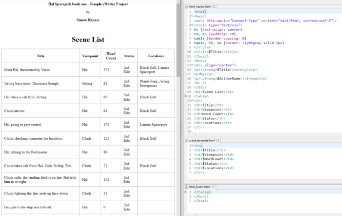](https://peter88213.github.io/yw2html/)

---

### yw2xtg

XPress tagged text export from yWriter projects.

[yw2xtg](https://peter88213.github.io/yw2xtg/)

---

### aeon2yw

Synchronize Aeon Timeline 2 and yWriter.

[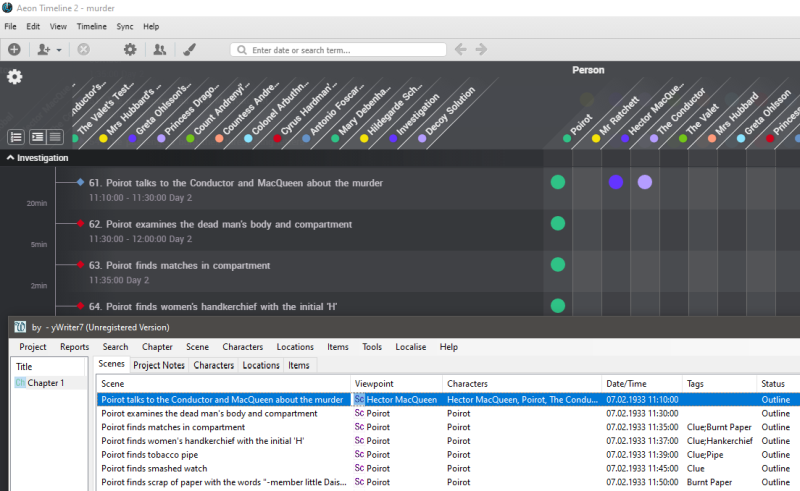](https://peter88213.github.io/aeon2yw/)

---

### scappex

Generate a yWriter 7 project from a Scapple outline.

[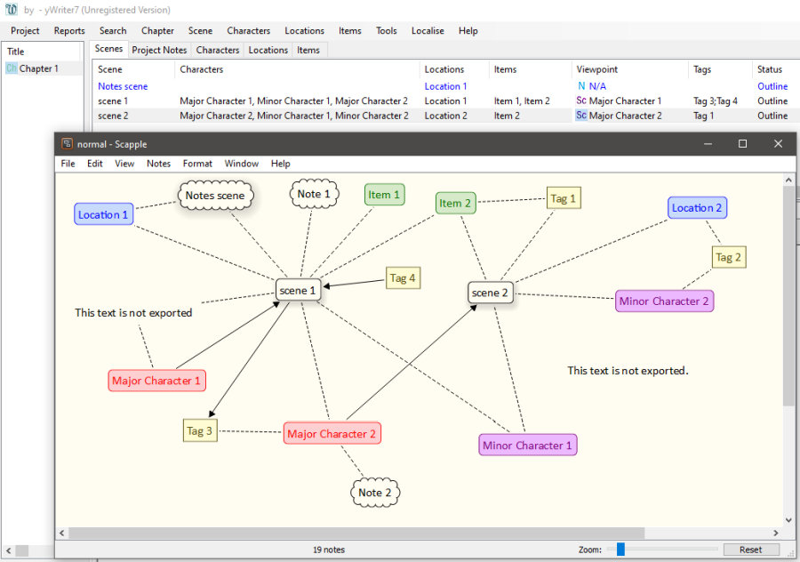](https://peter88213.github.io/scappex/)

---

### aeon3yw

Generate a yWriter 7 project from an Aeon 3 timeline.

[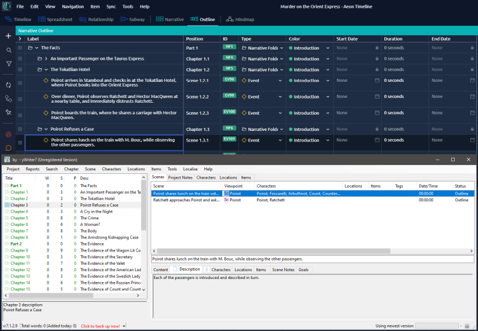](https://peter88213.github.io/aeon3yw/)

---

### yw2md

Markdown converter for yWriter projects.

[yw2md](https://peter88213.github.io/yw2md/)

---

### yw2odm

yWriter export to odm/odt documents.

[yw2odm](https://peter88213.github.io/yw2odm/)

---

### The PyWriter library

Read, write, and process yWriter7 files with Python 3.

[GitHub repository](https://github.com/peter88213/PyWriter/)

---

## Tools for transferring data to/from several applications

---

### aeon3odt

The aeon3odt extension for LibreOffice: Import Aeon Timeline 3 project data.

[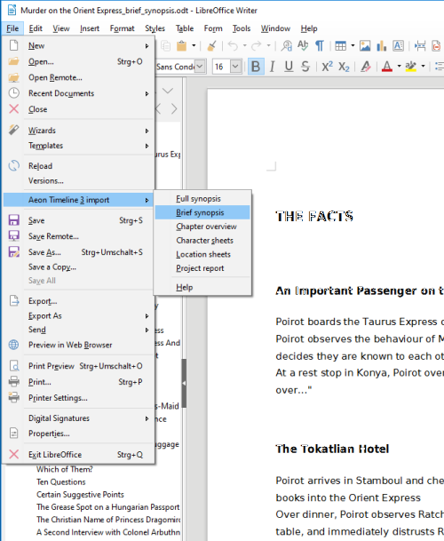](https://peter88213.github.io/aeon3odt/)

---

### aeon3md

Markdown export for Aeon Timeline 3.

[aeon3md](https://peter88213.github.io/aeon3md/)

---

### paeon

Tools for Aeon Timeline support.

[paeon tools](https://peter88213.github.io/paeon/)

---

### zim2obsidian
Post-process Zim Markdown export for use with Obsidian. 

[zim2obsidian](https://github.com/peter88213/zim2obsidian)

---

### manuskript_md

A Python script to create Markdown-formatted text files from a Manuskript project. 

[manuskript_md](https://github.com/peter88213/manuskript_md)

---
### manuskript-exporter

A Python application for Manuskript data export from outsides. 

[manuskript-exporter](https://github.com/peter88213/manuskript-exporter)

---

### yw2nw

Converter between yWriter and novelWriter.

[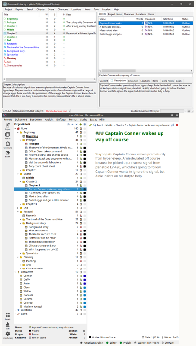](https://peter88213.github.io/yw2nw/)

---

### md2nw

Generate a novelWriter project from a work in progress written with any text editor or Markdown word processor.

[md2nw](https://github.com/peter88213/md2nw/)

---

### odt2nw

Generate a novelWriter project from a work in progress written with e.g. LibreOffice.

[odt2nw](https://github.com/peter88213/odt2nw/)

---

### mm2nw

Generate a novelWriter project from a FreeMind/Freeplane outline.

[mm2nw](https://github.com/peter88213/mm2nw/)

