# My open source projects on GitHub

---

## -- The yWriter toolbox

---

### The yw-cnv extension for LibreOffice
Import and export yWriter 7 projects.

---

### The pywoo extension for OpenOffice and Python
Import and export yWriter 7 projects.

[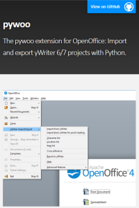](https://peter88213.github.io/pywoo/)

---

### yw-timeline
Synchronize yWriter with Timeline.

[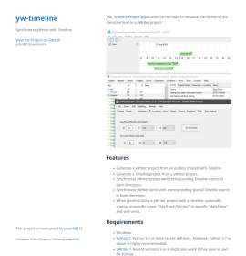](https://peter88213.github.io/yw-timeline/)

---

### aeon2yw
Generate a yWriter 7 project from an csv outline exported from Aeon Timeline 2.

[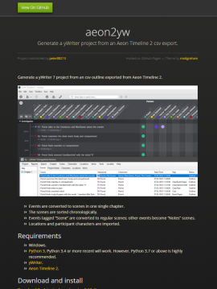](https://peter88213.github.io/aeon2yw/)

---

### yw-reporter
Configurable report generator for yWriter projects.

[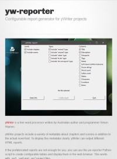](https://peter88213.github.io/yw-reporter/)

---

### yw-renumber 
Renumber yWriter chapters.

[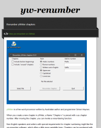](https://peter88213.github.io/yw-renumber/)

---

### yw2oo
yWriter to OpenOffice/LibreOffice standalone converter.

[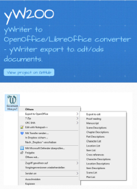](https://peter88213.github.io/yW2OO/)

---

### yw2html
HTML export from yWriter with templates.

[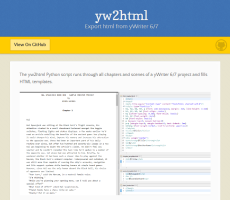](https://peter88213.github.io/yw2html/)

---

### yw2xtg
XPress tagged text export from yWriter projects.

---

### scappex
Generate a yWriter 7 project from a Scapple outline.

[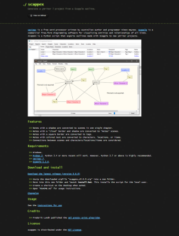](https://peter88213.github.io/scappex/)

---

### aeon3yw
Generate a yWriter 7 project from an csv outline exported from Aeon Timeline 3.

[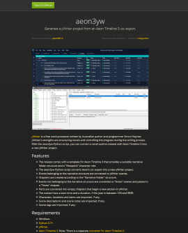](https://peter88213.github.io/aeon3yw/)

---

### yw2md
Markdown converter for yWriter projects.

[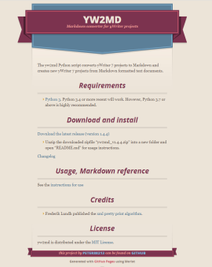](https://peter88213.github.io/yw2md/)

---
### yw2odm
yWriter export to odm/odt documents.

[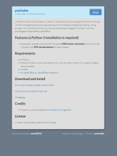](https://peter88213.github.io/yw2odm/)

---

## -- OpenOffice/LibreOffice helpers for self publishers

---

### The "curly" extensions for OpenOffice and LibreOffice
"Curly quotes" conversion.

[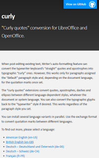](https://peter88213.github.io/curly/)

<!---

### The curly-fr-fr extension

[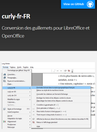](https://peter88213.github.io/curly-fr-FR/)

### The curly-en-us extension

[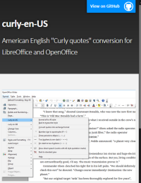](https://peter88213.github.io/curly-en-US/)

### The curly-en-gb extension

### The curly-de-de extension

[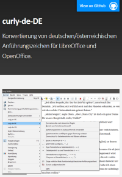](https://peter88213.github.io/curly-de-DE/)

### The curly-de-ch extension

[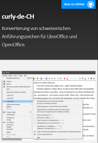](https://peter88213.github.io/curly-de-CH/)
--->

---

### The StyleSwitcher extension for OpenOffice and LibreOffice
A style switcher extension.

[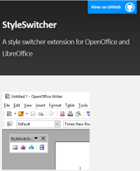](https://peter88213.github.io/StyleSwitcher/)

---

### The emph extension for OpenOffice
Use character styles instead of direct formatting to mark up text.

[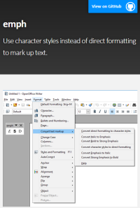](https://peter88213.github.io/emph/)

---

### The poemenia extension for OpenOffice
Localize the Pepito Cleaner extension.

---

### aeon3odt
The aeon3odt extension for LibreOffice: Import Aeon Timeline 3 project data.

---

## -- The PyWriter library
Read, write, and process yWriter7 files with Python 3.

[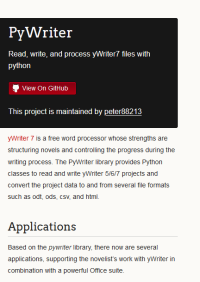](https://peter88213.github.io/PyWriter/)

