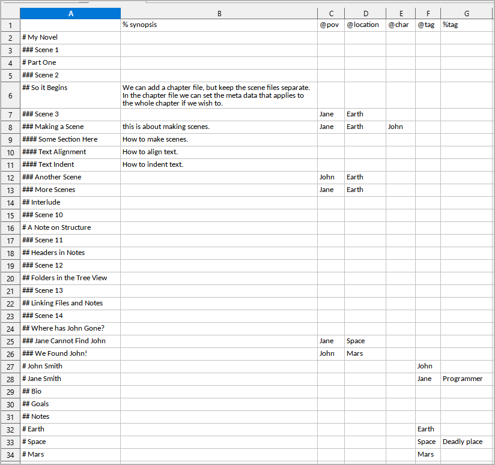
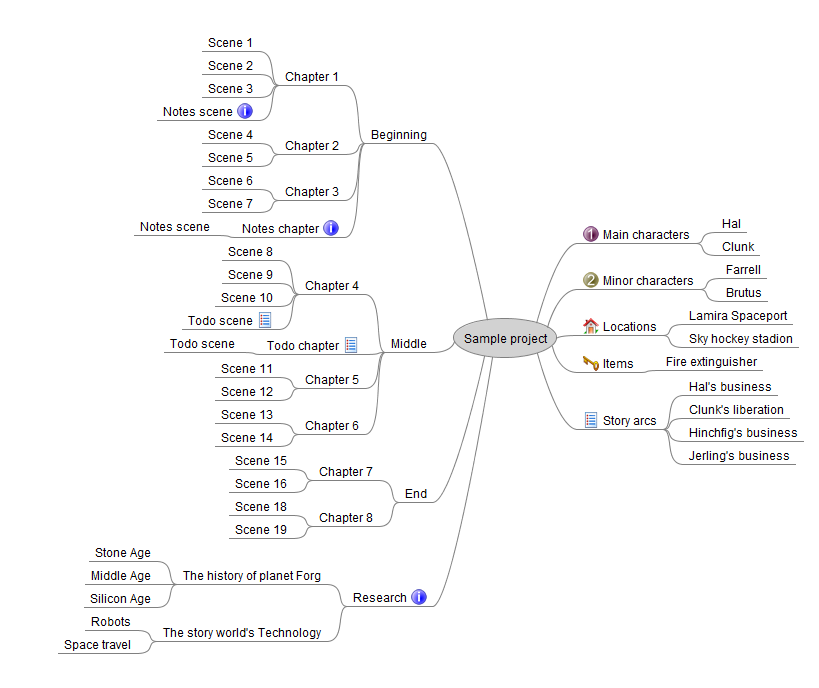

[Home page](index.html)

---

# novelWriter converters

---

## nw_metadata

Create a cross reference table with novelWriter metadata. 

---

## yw2nw

Converter between yWriter and novelWriter.

---

## md2nw

Generate a novelWriter project from a work in progress written with any text editor or Markdown word processor.

[md2nw](https://github.com/peter88213/md2nw/)

---

## odt2nw

Generate a novelWriter project from a work in progress written with e.g. LibreOffice.

[odt2nw](https://github.com/peter88213/odt2nw/)

---

## mm2nw

Generate a novelWriter project from a FreeMind/Freeplane outline.

